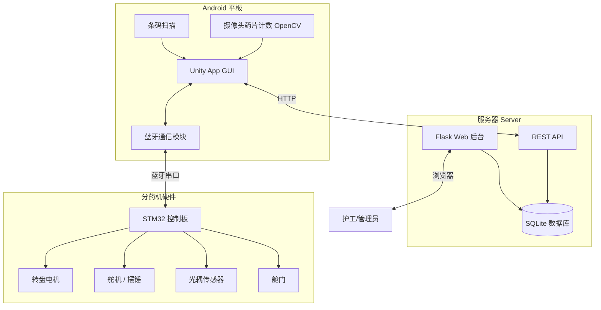

# EZ-Dose 养老院智能分药系统

> **面向养老院护工的自动化分药管理系统**
>
> 本系统实现了从处方录入、药盒验证、自动分药到记录上传的完整闭环流程，覆盖"服务器管理后台 → Android 平板控制 → STM32 分药机硬件"三级架构。

---

## 📖 项目概述

EZ-Dose 是一个养老院自动分药系统完整解决方案，核心目标是帮助护工安全、准确地为多位患者按处方分配药品。系统由三部分组成：

| 组件 | 技术栈 | 职责 |
|------|--------|------|
| **Server（后端服务器）** | Python / Flask / SQLite | 数据存储、Web 管理后台、REST API |
| **Unity App（Android 控制端）** | Unity / C# / OpenCV | 安卓平板 GUI、蓝牙通信、摄像头药片计数 |
| **Hardware（分药机硬件）** | STM32 / 蓝牙串口 | 电机驱动、光耦计数、舱门控制 |



---

## 🔄 核心工作流程

护工使用本系统完成一次分药操作的完整流程如下：

```
1. 首页 (Home)
   ├── 系统从服务器自动拉取"今天需要分药的患者列表"
   ├── 每位患者显示为一张卡片（姓名 + 床号 + 待分药品数）
   └── 护工点击患者卡片
            │
            ├── 检查蓝牙分药机是否已连接 → 未连接则提示前往设备管理
            └── 已连接 → 进入扫描页面
            
2. 扫描页 (Scan)
   ├── 打开安卓摄像头，持续扫描 Code128 / QR 条码
   ├── 条码解析出 Patient ID → 与选中患者比对
   │     ├── 匹配 → 弹出"药盒正确"对话框 → 生成分药计划 → 进入分药页
   │     └── 不匹配 → 弹出"药盒不匹配"对话框 → 可重试 / 返回首页
   └── 确保护工拿的是正确患者的药盒

3. 分药页 (Dispense)
   ├── 系统按处方生成"4×7 药片矩阵"（4行=早中晚+备用，7列=7天）
   ├── 药物按"饭前/随意吃"(盘1) 和 "饭后"(盘2) 分盘
   ├── 逐个药物发送矩阵给 STM32：
   │     ├── 若药物未校准（pill_size_area 为空）→ 弹出校准对话框
   │     │     └── 摄像头检测药片 → 基于参考药片计算 mm² → 保存到服务器
   │     ├── 根据药片大小配置电机转速和舵机角度
   │     ├── 发送矩阵 → 等待 STM32 完成（machine_state:FINISH）
   │     ├── 实时显示进度（已分 / 总数）
   │     └── 遇到计数错误 → 打开舱门 → 人工核对 → 确认后继续
   ├── 支持"跳过药物"操作（可选择是否标记为已分发）
   ├── 盘1分完 → 换盘提示 → 用户确认 → 继续盘2
   └── 全部完成 → 更新服务器记录 → 从列表中移除该患者 → 返回首页
```

---

## 📁 目录结构

```
Assets/Scripts/
│
├── server/                          # ===== 后端服务器（Python） =====
│   ├── main.py                      # Flask 主程序（API + Web 后台, ~1660行）
│   ├── data/
│   │   └── ezdose.db                # SQLite 数据库（自动创建）
│   ├── static/
│   │   ├── styles.css               # Web 后台样式
│   │   ├── images/                  # 患者照片 / 药片图片存储
│   │   └── js/                      # 前端 JavaScript
│   └── templates/                   # Jinja2 HTML 模板
│       ├── base.html                # 基础模板（导航栏、布局）
│       ├── login.html               # 登录页面
│       ├── dashboard.html           # 仪表板首页
│       ├── patients.html            # 患者管理列表
│       ├── patient_form.html        # 患者新增/编辑表单
│       ├── prescriptions.html       # 处方列表
│       ├── prescription_form.html   # 处方新增/编辑表单
│       ├── users.html               # 用户管理列表
│       ├── user_form.html           # 用户新增/编辑表单
│       ├── dispense_logs.html       # 分药记录
│       ├── operation_logs.html      # 操作审计日志
│       └── access_denied.html       # 权限不足提示
│
├── MainController.cs                # ===== 核心控制器 =====
│                                    # 分药流程主协调器（单例），管理患者列表、
│                                    # 生成分药计划、驱动硬件、处理换盘/出错/跳过
│
├── PrescriptionManager.cs           # ===== 处方管理 =====
│                                    # 从服务器拉取/推送处方数据、生成4×7药片矩阵、
│                                    # 计算分药天数、更新有效期
│
├── DispenserController.cs           # ===== 硬件通信 =====
│                                    # 蓝牙连接管理、设备发现、数据包发送（带ACK重试）、
│                                    # 反馈消息接收与解析（20Hz轮询）
│
├── SerialProtocol.cs                # ===== 串口协议 =====
│                                    # 定义与 STM32 的通信格式：
│                                    # 包头(0xAA 0xBB) + 命令 + 数据 + CRC16
│
├── PillCounter.cs                   # ===== 药片计数算法 =====
│                                    # OpenCV 图像处理：背景减法 → 二值化 →
│                                    # 形态学操作 → 轮廓分析 → 单颗/多颗判断
│
├── PillCounterController.cs         # ===== 药片计数控制器 =====
│                                    # 管理摄像头、驱动 PillCounter、显示结果
│
├── PillCalibrationManager.cs        # ===== 校准管理器 =====
│                                    # 像素面积→mm²转换、参考药片校准、
│                                    # 根据药片大小计算电机/舵机参数
│
├── PillCalibrationDialog.cs         # ===== 校准对话框 =====
│                                    # 分药过程中弹出的药片校准 UI
│
├── CheckPillBoxController.cs        # ===== 药盒条码扫描 =====
│                                    # 使用 ZXing 库解码 Code128/QR → 验证 Patient ID
│
├── UIManager.cs                     # ===== UI 管理器 =====
│                                    # 管理 Home/Scan/Dispense 三个场景的 UI 绑定、
│                                    # 子页面切换、进度条动画
│
├── ConfigurationUI.cs               # ===== 设置页面 =====
│                                    # 服务器 URL、分药天数、校准、硬件重置
│
├── DeviceManagerUI.cs               # ===== 蓝牙设备管理 =====
│                                    # 扫描/连接/断开蓝牙设备的对话框 UI
│
├── DeviceCardUI.cs                  # ===== 设备卡片 =====
│                                    # 单个蓝牙设备的列表项 UI 组件
│
├── BluetoothDeviceInfo.cs           # ===== 蓝牙设备信息 =====
│                                    # 设备名称、MAC 地址、配对状态数据类
│
├── ErrorResolutionUI.cs             # ===== 错误处理对话框 =====
│                                    # 分药计数错误时的用户干预 UI
│
├── PillImageLoader.cs               # ===== 药片图片加载 =====
│                                    # 从服务器下载并显示药品图片
│
├── AppConfig.cs                     # ===== 应用配置 =====
│                                    # 单例配置管理，基于 PlayerPrefs 持久化
│
├── BluetoothTest/                   # ===== 测试工具 =====
│   └── BluetoothTest.cs             # 蓝牙通信调试工具
│
├── pill_counter/
│   └── PillCounterTest.cs           # 药片计数算法测试
│
└── PythonRef/                       # Python 参考脚本
```

---

## 🏗️ 模块详解

### 1. MainController — 核心状态机

[MainController](file:///d:/Documents/Unity/Projects/EZ-Dose/Assets/Scripts/MainController.cs#16-1252) 是整个 Unity 端的"大脑"，采用 **Singleton + DontDestroyOnLoad** 模式，跨场景存活。

**核心职责：**

| 功能 | 说明 |
|------|------|
| 患者轮询 | 定时从服务器拉取处方列表，筛选出"今天需要分药"的患者（药物到期天数 ≤ 阈值） |
| 分药计划 | 调用 `PrescriptionManager.TryGenerateDispensingPlan()` 生成分盘方案 |
| 硬件驱动 | 逐个药物发送 4×7 矩阵，等待 STM32 完成信号 |
| 校准流程 | 检测药物是否已校准（`pill_size_area > 0`），未校准则触发校准对话框 |
| 错误恢复 | 收到 `CNT_ERR` → 打开舱门 → 等待用户手动核对 → 确认继续 |
| 跳过逻辑 | 用户可跳过当前药物，发送 `SKIP_TASK` 命令给 STM32 → 可选择是否标记为已分发 |
| 自动刷新 | 可配置间隔（默认30秒）自动刷新患者列表，分药期间自动暂停 |

**关键配置（运行时可调）：**

```
MaxDispensingDays      = 7    // 单次最多分配7天的药量
ExpiryDaysThreshold    = 2    // 剩余药量 ≤ 2天时触发分药
AutoRefreshInterval    = 30s  // 患者列表自动刷新间隔
```

### 2. PrescriptionManager — 处方与分药计划

**数据拉取与缓存：**
- 通过 `GET /packer/prescriptions` 拉取所有活跃处方（含 patient_name, bed_number JOIN 查询）
- 缓存在内存中 (`allRecords`)，用于生成分药计划

**分药计划生成逻辑：**
```
对于每个活跃药物：
  1. 计算 daysUntilExpiry = (last_dispensed_expiry_date - 今天) + 1
  2. 若 daysUntilExpiry > 阈值 → 跳过（不需要分药）
  3. 若处方已过期或已有足够药量 → 跳过
  4. dispensingDays = min(maxDays, 剩余处方天数)
  5. 生成 4×7 矩阵：
      行0 = 早上用量 (物理底部)
      行1 = 晚上用量 (物理中间)
      行2 = 中午用量 (物理顶部, 养老院第一餐)
      行3 = 备用行
      列0~6 = 第1天到第7天
```

**分盘策略：**
- 饭前/随时 → Plate 1
- 饭后 → Plate 2
- 若只有一种用餐时机 → 全部放 Plate 1（无需换盘）

### 3. DispenserController — 蓝牙硬件通信

**通信架构：**
```
Unity App  ←→  Android Bluetooth API (Java Plugin)  ←→  STM32 (蓝牙串口)
```

**设备管理：**
- 支持蓝牙设备发现（已配对设备列表）
- 按 MAC 地址连接
- Editor 模式下提供模拟设备用于开发

**数据收发：**
- **发送**：构建数据包 → 发送字节 → 等待 ACK（超时 0.2s）→ 最多重试 5 次
- **接收**：20Hz 轮询协程 → 行分割 → `SerialProtocol.FeedbackParser` 解析

### 4. SerialProtocol — 串口通信协议

**数据包格式：**
```
┌──────────┬──────────┬────────────┬──────────┐
│ 包头     │ 命令字节  │ 数据 (可变) │ CRC16    │
│ 0xAA BB  │ 1 byte   │ N bytes    │ 2 bytes  │
└──────────┴──────────┴────────────┴──────────┘
CRC = 累加和 & 0xFFFF（小端序）
```

**命令集：**

| 命令 | 代码 | 说明 |
|------|------|------|
| `SKIP_TASK` | 0x00 | 跳过当前分药任务 |
| `RESET_DISPENSER` | 0x01 | 摆锤零位校准 |
| `OPEN_TRAY` | 0x03 | 打开舱门 |
| `CLOSE_TRAY` | 0x04 | 关闭舱门 |
| `SEND_PILL_MATRIX` | 0x05 | 发送 4×7=28 字节药片矩阵 |
| `SET_OPTOCOUPLER_THRESH` | 0x06 | 设置光耦阈值 |
| `SET_OPTOCOUPLER_NORESP` | 0x07 | 设置光耦不响应期 |
| `SET_MOTOR_SPEED` | 0x08 | 设置转盘电机转速 |
| `SET_MOTOR_DELAY_STOP` | 0x09 | 设置电机刹车延迟 |
| `ACK` | 0x0A | 确认信号 |
| `SET_CLEAN_SPEED` | 0x0B | 设置清洁转速 |
| `SET_CLEAN_DELAY` | 0x0C | 设置清洁延迟 |

**STM32 反馈消息（文本格式）：**

| 消息 | 含义 |
|------|------|
| `machine init` | 硬件初始化完成 |
| `machine_state:FINISH` | 当前药物分药完成 |
| `machine_state:CNT_ERR` | 计数错误 |
| `pills out:N` | 已分出 N 颗药片（进度更新） |
| `ACK` | 命令已收到 |
| `DONE` | 阻塞操作完成（如复位） |

### 5. PillCounter — OpenCV 药片计数

**算法流程：**

```
摄像头帧 → 裁切边缘 → 灰度化 → 高斯模糊 → 背景减法 → 二值化(阈值40)
  → 形态学开运算(去噪) → 腐蚀(分离相连药片)
  → 连通组件分析 → 轮廓提取
  → 分类：
     单颗药片: 凸包度≥0.90, 实心度≥0.85, 长宽比≤3.0, 圆形度>0.3
     多颗粘连: 按参考面积比估算 (1.2倍=2颗, 2.4倍=3颗, ...)
  → 合计 → 输出计数 + 标注图像
```

**背景捕捉触发条件（双重稳定性检测）：**
1. 边缘稳定性：近10帧边缘像素数方差 < 8000 且均值 < 1000
2. 对焦稳定性：近10帧 Laplacian 方差的变异系数 < 0.5
3. 需连续 15 帧满足条件

**药片校准功能：**
- 放置一颗标准参考药片（默认 9mm 直径）
- 系统检测像素面积 → 计算 `pixelToMm2Ratio`
- 后续新药物可通过该比例自动换算 mm²

### 6. PillCalibrationManager — 校准与分药机参数计算

**校准原理：**
```
已知: 参考药片直径 = 9.0mm → 面积 = π × 4.5² ≈ 63.6 mm²
检测: 参考药片像素面积 = 5000 px
→ ratio = 63.6 / 5000 = 0.01272 mm²/px
→ 新药片检测 8000 px → 实际面积 = 8000 × 0.01272 ≈ 101.8 mm²
```

**分药机参数自动计算：**
```
药片面积 → 线性插值：
  小药片(13mm²): 电机转速=0.1, 舵机角度=1.0 (慢速大口)
  大药片(156mm²): 电机转速=1.4, 舵机角度=0.1 (快速小口)
```

### 7. CheckPillBoxController — 条码验证

- 使用 **ZXing** 库进行条码解码
- 支持 Code128、Code39、QR Code 格式
- 条码内容解析规则：
  - 纯数字 → 直接作为 Patient ID
  - `PID:000042` 或 `BOX:000042` → 提取 ID 部分
- Patient ID 采用 6 位零填充格式（`000001`~`999999`），适合 Code128 条码的固定宽度扫描

### 8. UIManager — 场景与页面管理

| 场景 | 组成 |
|------|------|
| **Home** | 患者列表（左侧） + 右侧子页面（患者卡片 / 数药 / 设置） |
| **Scan** | 摄像头预览 + 扫描动画光条 + 结果对话框 |
| **Dispense** | 进度条 + 药物信息 + 药片图片 + 跳过/暂停按钮 + 换盘/完成/错误对话框 |

**Home 子页面切换系统：**
```
PatientCard (默认) ←→ CountPills ←→ Setting
   按钮高亮导航 + 支持循环切换
```

---

## 🗃️ 数据库设计

### patients 表

| 字段 | 类型 | 说明 |
|------|------|------|
| [id](file:///d:/Documents/Unity/Projects/EZ-Dose/Assets/Scripts/DeviceManagerUI.cs#146-157) | TEXT (PK) | 6 位零填充 Patient ID（如 "000042"） |
| `patient_name` | TEXT | 患者姓名 |
| `bed_number` | TEXT | 床位号 |
| `profile_photo_resource_id` | TEXT | 头像文件名 |
| `created_at` | DATETIME | 创建时间 |

### prescriptions 表

| 字段 | 类型 | 说明 |
|------|------|------|
| [id](file:///d:/Documents/Unity/Projects/EZ-Dose/Assets/Scripts/DeviceManagerUI.cs#146-157) | INTEGER (PK) | 自增主键 |
| [patient_id](file:///d:/Documents/Unity/Projects/EZ-Dose/Assets/Scripts/server/main.py#89-117) | TEXT (FK) | 关联 patients.id |
| `medicine_name` | TEXT | 药品名称 |
| `morning_dosage` | REAL | 早餐剂量（颗） |
| `noon_dosage` | REAL | 午餐剂量 |
| `evening_dosage` | REAL | 晚餐剂量 |
| `meal_timing` | TEXT | `before_meal` / `after_meal` / `with_meal` |
| `start_date` | DATE | 开始日期 |
| `duration_days` | INTEGER | 持续天数 |
| `last_dispensed_expiry_date` | DATE | 最后一次分药覆盖到的日期 |
| `is_active` | INTEGER | 是否有效 (0/1) |
| `pill_size_area` | REAL | 药片面积 mm²（空=未校准） |
| `image_resource_id` | TEXT | 药品图片文件名 |
| `created_at` | DATETIME | 创建时间 |

### users 表

| 字段 | 类型 | 说明 |
|------|------|------|
| [id](file:///d:/Documents/Unity/Projects/EZ-Dose/Assets/Scripts/DeviceManagerUI.cs#146-157) | INTEGER (PK) | 自增主键 |
| `username` | TEXT (UNIQUE) | 用户名 |
| `password_hash` | TEXT | Werkzeug 密码哈希 |
| `can_edit_users` | INTEGER | 用户管理权限 (0/1) |
| `can_edit_patients` | INTEGER | 患者管理权限 (0/1) |
| `can_edit_prescriptions` | INTEGER | 处方管理权限 (0/1) |
| `can_view_logs` | INTEGER | 查看日志权限 (0/1) |

### dispense_logs 表

| 字段 | 类型 | 说明 |
|------|------|------|
| [id](file:///d:/Documents/Unity/Projects/EZ-Dose/Assets/Scripts/DeviceManagerUI.cs#146-157) | INTEGER (PK) | 自增主键 |
| `dispense_date` | DATE | 分药日期 |
| [patient_id](file:///d:/Documents/Unity/Projects/EZ-Dose/Assets/Scripts/server/main.py#89-117) | TEXT (FK) | 患者 ID |
| `prescription_id` | INTEGER (FK) | 处方 ID |
| `medicine_name` | TEXT | 药品名称 |
| `dosage` | REAL | 剂量 |
| `time_period` | TEXT | morning / noon / evening |
| `dispensed_by_user_id` | INTEGER (FK) | 操作用户 |

### operation_logs 表（审计日志）

| 字段 | 类型 | 说明 |
|------|------|------|
| [id](file:///d:/Documents/Unity/Projects/EZ-Dose/Assets/Scripts/DeviceManagerUI.cs#146-157) | INTEGER (PK) | 自增主键 |
| `operation_type` | TEXT | add / edit / delete / login / logout |
| `operation_category` | TEXT | user / patient / prescription / auth |
| `target_type` | TEXT | 目标类型 |
| `target_id` | INTEGER | 目标 ID |
| `target_name` | TEXT | 目标名称 |
| `details` | TEXT | 补充说明 |
| `user_id` | INTEGER (FK) | 操作用户 |
| `user_name` | TEXT | 用户名 |
| `ip_address` | TEXT | IP 地址 |
| `created_at` | DATETIME | 时间戳 |

### system_settings 表

| 字段 | 类型 | 说明 |
|------|------|------|
| `key` | TEXT (PK) | 配置键名 |
| `value` | TEXT | 配置值 |

---

## 🌐 API 接口

### 分药机端 API

| 方法 | 路径 | 说明 |
|------|------|------|
| GET | `/packer/patients` | 获取所有患者 |
| GET | `/packer/prescriptions` | 获取所有活跃处方（含患者信息 JOIN） |
| POST | `/packer/patients/upload` | 批量上传患者 |
| POST | `/packer/prescriptions/upload` | 批量上传/更新处方（含 `last_dispensed_expiry_date` 回写） |
| POST | `/packer/dispense` | 记录分药日志 |
| GET | `/packer/dispense_logs` | 查询分药记录 |

### 校准 API

| 方法 | 路径 | 说明 |
|------|------|------|
| GET/POST | `/packer/settings/calibration` | 获取/设置参考药片直径 |
| POST | `/packer/prescription/<id>/pill-size` | 更新处方的药片面积 |
| POST | `/packer/prescription/<id>/calibration` | 上传药片面积 + 图片（multipart） |

### Web 管理后台

| 路径 | 说明 |
|------|------|
| `/login` | 登录页面 |
| `/logout` | 登出 |
| `/admin` | 仪表板（统计总览） |
| `/admin/users` | 用户管理（增删改查） |
| `/admin/patients` | 患者管理 |
| `/admin/prescriptions` | 处方管理 |
| `/admin/dispense_logs` | 分药记录查询 |
| `/admin/logs` | 操作审计日志 |

---

## 🚀 部署指南

### 服务器部署

**环境要求：** Python 3.7+

```bash
# 1. 安装依赖
pip install flask werkzeug

# 2. 进入服务器目录
cd Assets/Scripts/server

# 3. 启动
python main.py
```

服务器启动后：
- API 地址：`http://<IP>:5050`
- 数据库自动创建于 `data/ezdose.db`
- 默认管理员：用户名 [admin](file:///d:/Documents/Unity/Projects/EZ-Dose/Assets/Scripts/server/main.py#993-1019) / 密码 `admin123`
- 日志文件：`data/ezdose.log`（10MB 轮转，保留 5 份）

**远程部署（反向代理）：**
修改 [main.py](file:///d:/Documents/Unity/Projects/EZ-Dose/Assets/Scripts/server/main.py) 中的 `URL_PREFIX`：
```python
# URL_PREFIX = ''           # 本地开发
URL_PREFIX = '/flask'       # Nginx 反向代理时取消注释
```

### Unity 客户端

1. 用 Unity 打开项目（推荐版本参见 ProjectSettings）
2. 切换平台为 **Android**
3. 确保已导入以下插件：
   - **OpenCV for Unity** — 药片计数算法
   - **ZXing.Net** — 条码扫描
   - **蓝牙串口插件** (`com.unity.bluetooth.BluetoothSerial`)
4. Build & Run 到 Android 平板

### 客户端配置

在 App 设置页面中配置：
- **服务器 URL**：指向部署的 Flask 服务器地址（默认 `http://127.0.0.1:5000`）
- **最大分药天数**：单次分药天数上限（默认 7 天）
- **到期提醒天数**：药量低于此天数时触发分药（默认 2 天）

### 硬件配对

1. 在 App 首页点击"分药机未连接"按钮
2. 扫描附近蓝牙设备
3. 选择分药机设备进行配对连接
4. 连接成功后可从设置页面进行摆锤零位校准

---

## ⚠️ 注意事项

1. **数据库安全**：生产环境请修改 `app.secret_key`，并为 admin 设置强密码
2. **蓝牙权限**：Android 12+ 需要运行时申请 `BLUETOOTH_CONNECT` 和 `BLUETOOTH_SCAN`
3. **摄像头权限**：条码扫描和药片计数均需要摄像头权限
4. **SQLite 并发**：SQLite 单写多读，高并发场景下可能需迁移到 PostgreSQL
5. **药片矩阵行顺序**：矩阵行顺序为 `[0]=早上(MorningDosage), [1]=晚上(EveningDosage), [2]=中午(NoonDosage), [3]=备用`，**不是**直觉的早中晚顺序。这是因为物理药盘从底到顶为 `早→晚→中`，分药机从顶部(中午)开始分药，对应养老院第一餐是午餐的工作流程

---

## 🧩 技术依赖

| 组件 | 依赖 | 用途 |
|------|------|------|
| 服务器 | Flask, Werkzeug, SQLite3 | Web 框架、密码哈希、数据库 |
| Unity 客户端 | Unity Engine | 跨平台 GUI 框架 |
| 条码扫描 | ZXing.Net | Code128/QR 码解码 |
| 药片计数 | OpenCV for Unity | 图像处理与轮廓分析 |
| 蓝牙通信 | Android Java Plugin | 蓝牙串口通信 |
| 分药机控制 | STM32 + 自定义协议 | 电机/舵机/光耦/舱门 |
